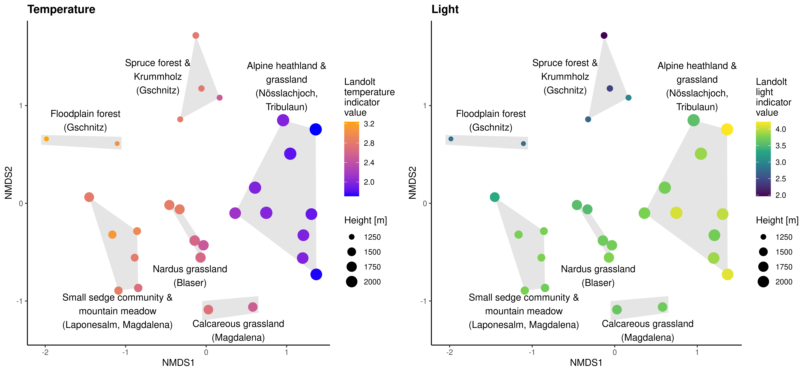
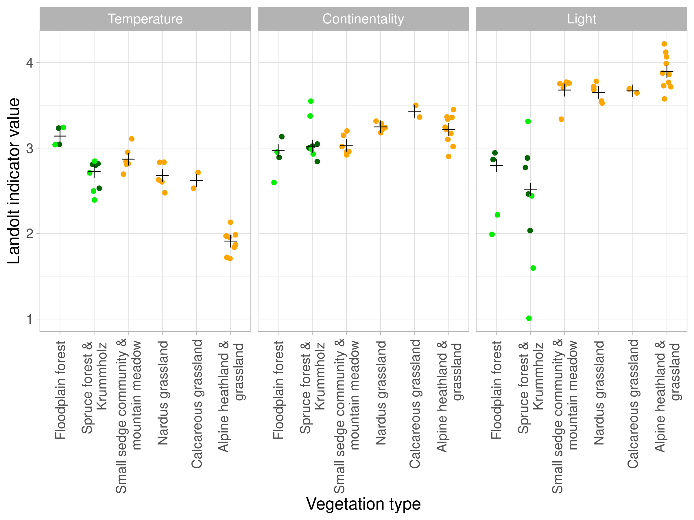

## Analysis of Vegetation data with Landolt temperature, continentality and light indicator values

### NMDS-Ordination

### Cover-weighted mean indicator values in the different vegetation types

